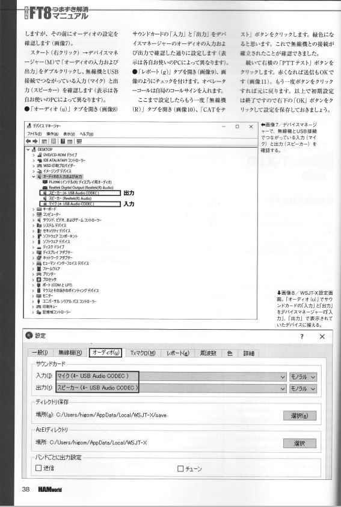

# ft8

<html lang="ja">
 <head>
  <meta charset="utf-8" />
	 

<link href="https://cdnjs.cloudflare.com/ajax/libs/lightbox2/2.7.1/css/lightbox.css" rel="stylesheet">
 
</head>
<body>

 <!--

  モバイル端末をお使いの場合は、画面を横向きにすると
  より見やすくご覧頂けます。

-->
	
<h1><marquee behavior="alternate">!!! HANworld 20217月号 FT8導入マニュアル !!!</marquee></h1>

<h3>該当記事の部分のみスキャンしました。</h3>

                                       

<marquee direction="left" scrollamount="5" width="85%">以上、本HPの展開は控えられますようお願いします！ (^_^)/~hada</marquee>

  

 

<!-- フッタ -->
 <footer>
 Copyright 2021/09/05 S.Hada
	 </footer>
